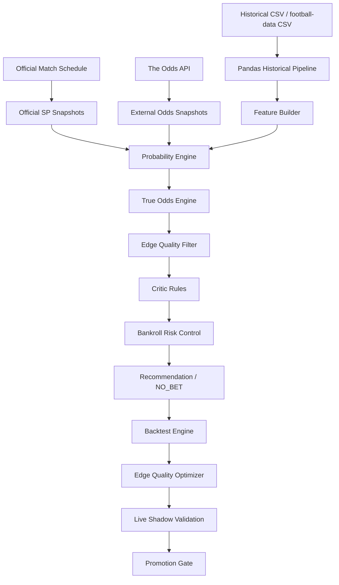

# Football Multi-Agent Probability Decision System

## 1. Project Overview

This project is a research-oriented football pre-match probability decision system. It estimates calibrated match probabilities and fair odds, compares them with official SP values, and uses backtesting, CLV, edge quality filtering, bankroll risk control, and live shadow validation to evaluate whether a recommendation is reliable. It does not place bets automatically and does not guarantee profit.

中文简介：本项目是一个面向竞彩足球赛前决策的多 Agent 概率系统。系统以官方 SP 为核心锚点，融合外部市场赔率、历史比赛数据和增强足球模型，生成模型概率、市场概率、真实赔率估计和风险过滤结果。项目通过 True Odds Engine、Edge Quality Filter、Walk-forward 回测、CLV 分析、资金风控和 Live Shadow Validation 判断推荐是否具有更可靠的正期望。系统不会自动下注，也不保证盈利，定位是概率建模与决策辅助研究平台。

## 2. Core Features

1. Official SP normalization
2. External market consensus
3. Enhanced pure football model
4. Multi-de-vig true odds engine
5. Probability uncertainty and lowerBoundEV
6. Edge Quality Filter
7. Adaptive EV threshold
8. Walk-forward backtest
9. CLV analysis
10. Stacking challenger model
11. Bankroll and portfolio risk control
12. Live odds monitoring
13. Model governance
14. Live Shadow Validation
15. Promotion Gate
16. System health and data governance
17. Pandas historical data pipeline

## 3. System Architecture



More details are in [docs/02_system_architecture.md](docs/02_system_architecture.md).

## 4. Algorithm Pipeline

The production EV formula remains:

```text
EV = finalProbability * officialSp - 1
```

The high-level pipeline is:

1. Normalize official SP into implied probability.
2. Convert external bookmaker odds into de-vigged market consensus probability.
3. Build pure football probabilities from historical team features and model signals.
4. Optionally evaluate a stacking challenger model when explicitly enabled.
5. Estimate true odds with multiple de-vig methods and uncertainty bounds.
6. Apply Edge Quality and adaptive threshold checks.
7. Run Critic rules for stale odds, low data quality, high disagreement, and lifecycle issues.
8. Apply bankroll and portfolio risk limits.
9. Use Shadow Validation to evaluate new filters without mutating production recommendations.

True Odds Engine is FILTER_ONLY by default. ADJUST_PROBABILITY is not enabled by default.

## 5. Data Sources

- Official matches and SP: official China Sports Lottery style schedule/SP integration in project logic.
- External odds: The Odds API, configured by `THE_ODDS_API_KEY`.
- Historical data: local CSV and football-data.co.uk CSV processed by pandas.
- No soccerdata dependency is required.
- News, lineup, and weather are supported as structured signals or future extensions; they should not be assumed stable real-time sources unless configured and validated.

## 6. Installation

Windows PowerShell:

```powershell
cd C:\Users\86186\Desktop\gambling\Gambling

C:\Users\86186\AppData\Local\Programs\Python\Python312\python.exe -m venv .venv
.\.venv\Scripts\python.exe -m pip install --upgrade pip
.\.venv\Scripts\python.exe -m pip install -e ".[dev]"
```

Frontend:

```powershell
cd frontend
npm install
```

## 7. Environment Variables

Create a local environment file:

```powershell
Copy-Item .env.example .env
```

Do not commit real keys or local runtime paths. Important settings:

- `THE_ODDS_API_KEY`: external odds API key, never committed.
- `LLM_PROVIDER=qwen`, `LLM_API_KEY`, `LLM_BASE_URL`, `LLM_MODEL`: Qwen-compatible LLM settings.
- `ENABLE_AUTO_BETTING=false`: must remain false.
- `ENABLE_STACKING_MODEL=false`: challenger mode is opt-in.
- `ENABLE_REAL_SYNC=false`: user-controlled real data sync switch.
- `DATABASE_URL=sqlite:///./data/runtime/football_agents.db`: local runtime DB path.
- `OFFICIAL_SP_REFRESH_MINUTES=15`: official fixture/SP capture and its evidence-quality check cadence.
- The same 15-minute chain independently reads the public official result archive, settles exact
  `sporttery-{matchId}` matches without overwriting conflicts, and freezes a critical-window
  prospective prediction after the latest SP observation.
- `OFFICIAL_RESULTS_SOURCE_URL` configures the public result page and
  `OFFICIAL_RESULTS_LOOKBACK_DAYS=60` controls incremental result backfill coverage.
- After the official-SP promotion gate, `paper_portfolio_allocation` can create immutable paper
  positions from the latest non-stale executable SP. It recalculates EV from the frozen probability,
  applies quarter-Kelly, daily/strategy/league caps, and prevents duplicate exposure to one match.
- Mature official-SP evidence is promoted only when a deterministic settlement-day block bootstrap
  puts the 95% lower bounds of ROI and average CLV above zero. The frozen model must also be no worse
  than the paired de-vig market baseline on both Brier score and Log Loss, with statistically positive
  improvement on at least one of those calibration metrics.
- `paper_portfolio_settlement` runs after the official result collector and records profit, closing
  SP, CLV, equity, and drawdown. Before promotion it records an auditable cash HOLD and never invents
  a position. No real order-placement integration exists.
- `PAPER_PORTFOLIO_REPORT_PATH` controls the generated ledger summary location.
- `external_consensus_challenger_capture` runs after the hourly frozen-model capture. It archives an
  immutable policy and one decision for every aligned official-SP/external-bookmaker snapshot. The
  policy requires at least 10 fresh bookmakers, shrinks and caps the model residual, subtracts a
  bookmaker-dispersion uncertainty margin, and records honest `NO_BET` decisions when executable EV
  is absent. It cannot enter allocation before 200 settlements, six active months, and 180 calendar days.
- `EXTERNAL_CONSENSUS_CHALLENGER_REPORT_PATH` controls its prospective report location.
- `BACKGROUND_AGENT_INTERVAL_SECONDS=3600`: cadence for heavier enrichment, history, backtest, and governance agents.

The API process must remain running for these in-process agents to execute. The scheduler runs immediately on startup; official SP capture then runs every 15 minutes, while the heavier agents run hourly.

## 8. Database Initialization

```powershell
.\.venv\Scripts\python.exe -m football_agents.cli init-db
```

The command creates the SQLite schema and applies migrations from `football_agents/migrations/`.

## 9. Running the App

Backend:

```powershell
.\.venv\Scripts\python.exe -m football_agents.cli serve
```

Frontend:

```powershell
cd frontend
npm run dev
```

Common local URLs:

- API and dashboard: `http://127.0.0.1:8000`
- Dashboard route: `http://127.0.0.1:8000/dashboard`
- OpenAPI docs: `http://127.0.0.1:8000/docs`
- Frontend dev server: Vite will print the active local URL.

## 10. Tests

Backend:

```powershell
.\.venv\Scripts\python.exe -m pytest -q
```

Frontend:

```powershell
cd frontend
npm test
npm run build
```

Latest local validation during Phase 13:

- Backend: 77 passed
- Frontend: 41 files / 130 tests passed
- Build: passed

## 11. Main Pages

- Dashboard: system overview and official match pool.
- Recommendations: filtered recommendation list and NO_BET reasons.
- Match Detail: model probability, fair odds, True Odds Analysis, Edge Quality, and critic report.
- Backtest: historical validation, CLV, optimizer, and blocked recommendation analysis.
- Bankroll / Portfolio Risk: stake sizing, exposure limits, drawdown mode, and risk controls.
- Live Monitor: odds snapshots, stale checks, and recalculation workflow.
- Agent / Workflow Monitor: automated service chain and step-level status.
- System Health: DB, sync, model governance, data quality, and shadow validation health.
- Settings: environment and risk configuration visibility.

## 12. CLI Commands

```powershell
.\.venv\Scripts\python.exe -m football_agents.cli init-db
.\.venv\Scripts\python.exe -m football_agents.cli serve
.\.venv\Scripts\python.exe -m football_agents.cli import-history football_agents\sample_data\historical_matches.csv
.\.venv\Scripts\python.exe -m football_agents.cli sync-history --years-back 3
.\.venv\Scripts\python.exe -m football_agents.cli sync-international-history
.\.venv\Scripts\python.exe -m football_agents.cli sync-data --limit 40
.\.venv\Scripts\python.exe -m football_agents.cli optimize-edge-quality football_agents\sample_data\historical_matches.csv --max-configs 50 --min-samples 200 --output result.json
.\.venv\Scripts\python.exe -m football_agents.cli create-shadow-config --from-optimization <run_id> --name "true-odds-v1"
.\.venv\Scripts\python.exe -m football_agents.cli start-shadow-validation <config_version_id>
.\.venv\Scripts\python.exe -m football_agents.cli run-shadow <config_version_id>
.\.venv\Scripts\python.exe -m football_agents.cli evaluate-shadow <config_version_id>
.\.venv\Scripts\python.exe -m football_agents.cli shadow-metrics <config_version_id>
.\.venv\Scripts\python.exe -m football_agents.cli evaluate-promotion <config_version_id>
.\.venv\Scripts\python.exe -m football_agents.cli activate-filter-only <config_version_id> --confirm
```

`activate-filter-only` requires explicit human confirmation. ADJUST_PROBABILITY cannot be automatically activated.

## 13. Risk Disclaimer

- This system does not guarantee profit.
- It does not place bets automatically.
- Backtest results do not guarantee future results.
- Recommendations are probabilistic and can be wrong.
- Betting involves financial risk.
- The project is for research and decision-support purposes.
- Live Shadow Validation is an observation mechanism, not production activation.

## 14. Repository Hygiene

Do not commit:

- `.env`
- `api.env`
- real SQLite databases
- `data/runtime`
- `data/cache`
- `data/raw`
- `data/logs`
- `node_modules`
- generated build outputs
- API keys, cookies, tokens, or local secrets

Sample data and documentation can be committed. See [docs/10_github_delivery_checklist.md](docs/10_github_delivery_checklist.md) before pushing to GitHub.
