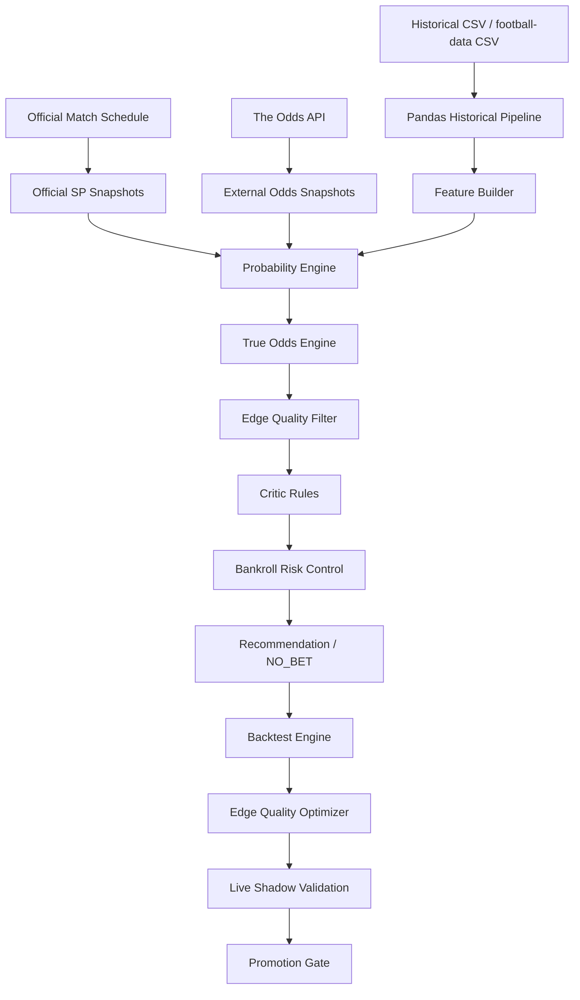

# Football Multi-Agent Probability Decision System

## 1. Project Overview

This project is a research-oriented football pre-match probability decision system. It estimates calibrated match probabilities and fair odds, compares them with official SP values, and uses backtesting, CLV, edge quality filtering, bankroll risk control, and live shadow validation to evaluate whether a recommendation is reliable. It does not place bets automatically and does not guarantee profit.

中文简介：本项目是一个面向竞彩足球赛前决策的多 Agent 概率系统。系统以官方 SP 为核心锚点，融合外部市场赔率、历史比赛数据和增强足球模型，生成模型概率、市场概率、真实赔率估计和风险过滤结果。项目通过 True Odds Engine、Edge Quality Filter、Walk-forward 回测、CLV 分析、资金风控和 Live Shadow Validation 判断推荐是否具有更可靠的正期望。系统不会自动下注，也不保证盈利，定位是概率建模与决策辅助研究平台。

## 2. Core Features

1. Official SP normalization
2. External market consensus
3. Enhanced pure football model
4. Multi-de-vig true odds engine
5. Probability uncertainty and lowerBoundEV
6. Edge Quality Filter
7. Adaptive EV threshold
8. Walk-forward backtest
9. CLV analysis
10. Stacking challenger model
11. Bankroll and portfolio risk control
12. Live odds monitoring
13. Model governance
14. Live Shadow Validation
15. Promotion Gate
16. System health and data governance
17. Pandas historical data pipeline

## 3. System Architecture



More details are in [docs/02_system_architecture.md](docs/02_system_architecture.md).

## 4. Algorithm Pipeline

The production EV formula remains:

```text
EV = finalProbability * officialSp - 1
```

The high-level pipeline is:

1. Normalize official SP into implied probability.
2. Convert external bookmaker odds into de-vigged market consensus probability.
3. Build pure football probabilities from historical team features and model signals.
4. Optionally evaluate a stacking challenger model when explicitly enabled.
5. Estimate true odds with multiple de-vig methods and uncertainty bounds.
6. Apply Edge Quality and adaptive threshold checks.
7. Run Critic rules for stale odds, low data quality, high disagreement, and lifecycle issues.
8. Apply bankroll and portfolio risk limits.
9. Use Shadow Validation to evaluate new filters without mutating production recommendations.

True Odds Engine is FILTER_ONLY by default. ADJUST_PROBABILITY is not enabled by default.

## 5. Data Sources

- Official matches and SP: official China Sports Lottery style schedule/SP integration in project logic.
- External odds: The Odds API, configured by `THE_ODDS_API_KEY`.
- Historical data: local CSV and football-data.co.uk CSV processed by pandas.
- No soccerdata dependency is required.
- News, lineup, and weather are supported as structured signals or future extensions; they should not be assumed stable real-time sources unless configured and validated.

### Historical Odds Evidence

The project supports three distinct evidence paths. They must not be mixed when
evaluating an odds-edge strategy:

1. `football-data.co.uk` World Cup workbook: a free, reproducible World Cup and
   qualifier results/1X2 archive. Run `python -m football_agents.cli
   sync-international-odds-history --provider football-data-world-cup`.
2. The Odds API historical endpoint: a paid, timestamped multi-bookmaker feed.
   Configure `THE_ODDS_API_KEY`, obtain historical access from the provider, then
   run `python -m football_agents.cli sync-international-odds-history --provider
   odds-api --sport-keys soccer_uefa_nations_league --from-date 2025-03-01
   --to-date 2025-03-31 --step-days 1 --max-snapshots 31`. Raw JSON snapshots are
   archived under `data/historical_csv/the_odds_api`; the importer rejects any
   snapshot captured at or after kickoff and creates a bookmaker-de-vigged 1X2
   consensus rather than averaging prices directly.
3. A licensed vendor CSV export: configure a pre-signed HTTPS export URL in
   `HISTORICAL_DATA_EXTRA_CSV_SOURCES` and run `python -m football_agents.cli
   sync-extra-history`. The CSV needs a date, teams, final score, and pre-match
   1X2 odds columns. Provider API tokens belong in its credential store or signed
   URL, never in source control.

Use the source-specific archive and source timestamp for walk-forward cutoffs.
Results-only sources improve team features but are not evidence for a betting-edge
claim.

### Free Data Plan

Run the no-cost international plan with:

```powershell
python -m football_agents.cli sync-free-historical-data
```

It archives broad international results for feature construction and the
football-data.co.uk World Cup workbook for market-calibration research. The workbook
contains average/max closing prices rather than a named bookmaker's executable price,
so it must not be used to claim executable profit or to allocate the daily 100 budget.
Its machine-readable evidence boundary is saved to
`data/historical_csv/free_plan_manifest.json`; use it to keep results-only and
average/max-price rows out of price/EV validation. The equivalent API is
`POST /api/historical-matches/sync-free-plan`.

### Free Prospective Odds Plan

The free prospective collector runs on startup and then in the hourly background
pipeline. It targets only official-pool matches around T-6h and T-1h, requests one
region and the H2H market, and stops before either the configured monthly budget or
provider reserve is breached.

```env
PROSPECTIVE_FREE_MODE=true
PROSPECTIVE_MONTHLY_CREDIT_BUDGET=450
PROSPECTIVE_CREDIT_RESERVE=50
PROSPECTIVE_MAX_ACTIVE_SPORTS=3
PROSPECTIVE_SNAPSHOT_OFFSETS_HOURS=6,1
ODDS_API_REGIONS=eu
```

Manual capture and status checks:

```powershell
python -m football_agents.cli capture-free-prospective-odds --limit 100
Invoke-RestMethod http://127.0.0.1:8000/api/research/free-prospective/status
```

Every accepted quote is stored in `prospective_external_odds_snapshots` with the
event id, named bookmaker, provider update time, capture time, kickoff, capture
window, raw event JSON, and SHA256. Database triggers forbid updates and deletes.
`odds_api_quota_ledger` is also immutable.

The named-book prospective challenger uses the best available named-book price as
the execution quote and a robust de-vigged consensus that excludes that bookmaker
as the reference. It requires at least four independent reference books. A
pre-decision pure-football model may
move each market probability by at most two percentage points. Candidate EV uses
the recorded execution price, a dispersion-aware probability lower bound, and a
two-percent execution haircut. Its paper curve uses quarter Kelly, a 10-unit
single-match cap, a 100-unit daily cap, and cash reserve on days without qualified
selections. Decision and settlement dates are separate; a result is ignored unless
its `settled_at` timestamp is later than both the frozen decision and kickoff. No
real order placement is implemented.

For a non-cherry-picked historical bridge replay, use the two-stage latest-month
protocol. `prepare` selects from the preceding six months and seals the latest
complete month before `evaluate` can reveal it. A dataset hash prevents the source
from changing between stages, and a second evaluation of the same sealed month is
rejected. `audit` separates nominal P/L from minimum-sample and direction-concentration
requirements:

```powershell
python -m scripts.robust_consensus_latest_month_holdout prepare
python -m scripts.robust_consensus_latest_month_holdout evaluate
python -m scripts.robust_consensus_latest_month_holdout audit
```

The live research path freezes two policies against the same immutable T-1 snapshot:
v3.1 remains the broad control, while v4.1 requires reference probability >=25%, odds
<=4.0, and conservative EV >=1%. Both convert exchange gross odds to net executable
odds before EV and settlement using `EXCHANGE_COMMISSION_RATE` (5% is only the
conservative default; configure the actual account/package rate). Slippage is applied
to the profit component, so selection and paper settlement share one price formula.
Compare them at
`GET /api/research/named-book-gap/experiment`; neither policy can place orders.

## 6. Installation

Windows PowerShell:

```powershell
cd C:\Users\86186\Desktop\gambling\Gambling

C:\Users\86186\AppData\Local\Programs\Python\Python312\python.exe -m venv .venv
.\.venv\Scripts\python.exe -m pip install --upgrade pip
.\.venv\Scripts\python.exe -m pip install -e ".[dev]"
```

Frontend:

```powershell
cd frontend
npm install
```

## 7. Environment Variables

Create a local environment file:

```powershell
Copy-Item .env.example .env
```

Do not commit real keys or local runtime paths. Important settings:

- `THE_ODDS_API_KEY`: external odds API key, never committed.
- `LLM_PROVIDER=qwen`, `LLM_API_KEY`, `LLM_BASE_URL`, `LLM_MODEL`: Qwen-compatible LLM settings.
- `ENABLE_AUTO_BETTING=false`: must remain false.
- `ENABLE_STACKING_MODEL=false`: challenger mode is opt-in.
- `ENABLE_REAL_SYNC=false`: user-controlled real data sync switch.
- `DATABASE_URL=sqlite:///./data/runtime/football_agents.db`: local runtime DB path.
- `DB_RETENTION_DAYS=90`, `DB_BACKTEST_RETENTION_DAYS=180`, `DB_VACUUM_INTERVAL_HOURS=24`: housekeeping knobs for the background cleanup thread. High-churn mutable tables (odds snapshots, fetch/sync logs, audit events, task runs, model predictions, critic/bet signals, shadow time series, backtest artifacts) are pruned past the cutoff and the database is VACUUMed at the configured cadence. Immutable evidence ledgers (official odds/result observations, prospective predictions, paper portfolio, external consensus decisions) are never deleted.
- `OFFICIAL_BROWSER_PATH`: Chromium-family browser used by the official data sync (CDP). Leave empty to auto-detect Edge/Chrome from common install locations and PATH; set explicitly to override.
- `OFFICIAL_SP_REFRESH_MINUTES=15`: official fixture/SP capture and its evidence-quality check cadence.
- A dedicated **closing-capture thread** (`official_sp_closing_capture`) runs every
  `LIVE_FAST_REFRESH_MINUTES=5` minutes but only spins up the browser when at least
  one offered official match kicks off within the next 60 minutes. It guarantees a
  `T_MINUS_1H` official-SP observation for every offered match, directly driving the
  `closing_sp_within_1h` evidence-quality check toward `EVIDENCE_READY`. It reuses the
  same `OfficialDataService._lock` so it never launches a second browser alongside the
  15-minute thread.
- The same 15-minute chain independently reads the public official result archive, settles exact
  `sporttery-{matchId}` matches without overwriting conflicts, and freezes a critical-window
  prospective prediction after the latest SP observation.
- `OFFICIAL_RESULTS_SOURCE_URL` configures the public result page and
  `OFFICIAL_RESULTS_LOOKBACK_DAYS=60` controls incremental result backfill coverage.
  A `sync-official-results` CLI command can trigger a manual backfill when a settlement is missing.
- Reaching `EVIDENCE_READY` requires the Windows scheduled task to keep the backend
  alive continuously through evening kickoffs; reinstall it with
  `scripts\install-backend-scheduled-task.ps1` after any script change. A missed capture
  cycle in the final hour is the root cause of `EVIDENCE_DEGRADED`.
- After the official-SP promotion gate, `paper_portfolio_allocation` can create immutable paper
  positions from the latest non-stale executable SP. It recalculates EV from the frozen probability,
  applies quarter-Kelly, daily/strategy/league caps, and prevents duplicate exposure to one match.
- Mature official-SP evidence is promoted only when a deterministic settlement-day block bootstrap
  puts the 95% lower bounds of ROI and average CLV above zero. The frozen model must also be no worse
  than the paired de-vig market baseline on both Brier score and Log Loss, with statistically positive
  improvement on at least one of those calibration metrics. The main prospective study, the profit
  scorer, and the external-consensus challenger all share this **same settlement-day block bootstrap**
  (seed 42, 5000 iterations) so the confirmation endpoint reproduces the documented methodology.
- The main prospective research study (`PROSPECTIVE_RESEARCH_STUDY_NAME` =
  `frozen-ensemble-market-anchor-v2-t60-confirmation-2026-oos200`) uses
  `PROSPECTIVE_RESEARCH_MIN_SETTLED=200` and `PROSPECTIVE_RESEARCH_MIN_DAYS=180`, aligned
  with the external-consensus challenger, so the first promotable decision can arrive in
  roughly six months. Statistical safety is still enforced by the settlement-day block
  bootstrap's 95% lower bound being above zero.
- `paper_portfolio_settlement` runs after the official result collector and records profit, closing
  SP, CLV, equity, and drawdown. Before promotion it records an auditable cash HOLD and never invents
  a position. No real order-placement integration exists.
- **Portfolio-level drawdown control (tiered, paper-only, ACTIVE):** the paper-portfolio risk
  policy (`tiered-drawdown-paper-active-v3`) now actively scales stakes. CAUTION (≥2 consecutive
  losing settlement days or ≥10% peak drawdown) reduces the daily budget multiplier to 0.75;
  DEFENSIVE (≥4 days or ≥15%) to 0.50; PAUSED (≥6 days or ≥20%, including a trailing-30-day
  rolling max drawdown) to 0.0 and halts all new paper positions. Open (unsettled) positions are
  marked to market against the latest official SP so the breaker can trip before settlement reveals
  the loss. `recovery_multiplier=0.50` keeps stakes half-reduced until drawdown falls below 5%.
  This is paper-only: `ENABLE_AUTO_BETTING=false` is permanent, there is no real-money order
  interface, and the immutable settlement ledger is never rewritten by MTM.
- `PAPER_PORTFOLIO_REPORT_PATH` controls the generated ledger summary location.
- `external_consensus_challenger_capture` runs after the hourly frozen-model capture. It archives an
  immutable policy and one decision for every aligned official-SP/external-bookmaker snapshot. The
  policy requires at least 10 fresh bookmakers, shrinks and caps the model residual, subtracts a
  bookmaker-dispersion uncertainty margin, and records honest `NO_BET` decisions when executable EV
  is absent. Candidate policy v4 also requires external consensus probability of at least 0.40 and
  may retain at most three candidates per settlement day. It cannot enter allocation before 200
  settlements, six active months, and 180 calendar days.
- `EXTERNAL_CONSENSUS_CHALLENGER_REPORT_PATH` controls its prospective report location.
- `BACKGROUND_AGENT_INTERVAL_SECONDS=3600`: cadence for heavier enrichment, history, backtest, and governance agents.
- `EXTERNAL_ODDS_CAPTURE_WINDOW_MINUTES=180`: spend external-odds quota only on matches close enough to feed the registered T-60 to T-120 study.
- A dedicated `external_odds_primary_horizon_capture` thread checks the T-60 to T-120
  window every `LIVE_FAST_REFRESH_MINUTES` minutes. It runs odds-only, so news or weather
  timeouts cannot delay the primary market snapshot, and it skips matches already captured
  in that horizon. A successful snapshot immediately triggers feature, prospective,
  challenger, and readiness evidence tasks.
- `ODDS_API_REGIONS=eu`: request one bookmaker region by default to conserve quota while retaining multi-book consensus.
- `ODDS_API_MIN_REQUESTS_REMAINING=20`: preserve an emergency quota reserve instead of exhausting the account before the primary horizon.

The API process must remain running for these in-process agents to execute. The scheduler runs immediately on startup; official SP capture then runs every 15 minutes, official closing and external primary-horizon capture threads check every 5 minutes while matches are imminent, the heavier agents run hourly, and a separate db-cleanup thread prunes mutable tables and VACUUMs the database every 24 hours by default.

## 7.1 Secret Safety

- `api.env` holds real plaintext `THE_ODDS_API_KEY` and `LLM_API_KEY`. It is listed in `.gitignore` and must never be committed.
- If a key has been displayed, shared, or suspected exposed, rotate it at the provider console (DashScope for the Qwen key, The Odds API dashboard for the odds key) and replace the matching line in `api.env`. Rotation is an external, user-controlled action — nothing in this codebase can do it for you.
- `docker-compose.yml` references `api.env` via `env_file` only; it contains no inline secrets.

## 8. Database Initialization

```powershell
.\.venv\Scripts\python.exe -m football_agents.cli init-db
```

The command creates the SQLite schema and applies migrations from `football_agents/migrations/`.

## 9. Running the App

Backend:

```powershell
.\.venv\Scripts\python.exe -m football_agents.cli serve
```

For continuous Windows collection across terminal closes and process failures, install the
per-user scheduled task once:

```powershell
powershell -ExecutionPolicy Bypass -File scripts\install-backend-scheduled-task.ps1
```

The task starts at sign-in and has a minutely watchdog trigger; `IgnoreNew` prevents duplicate
processes while a healthy instance is running. It uses a hidden `wscript.exe` launcher, so no
PowerShell console window is displayed. Runtime output is
written to `data/runtime/backend-service.log`. It does not enable real-money auto betting.
Remove it with `scripts\uninstall-backend-scheduled-task.ps1`.

Frontend:

```powershell
cd frontend
npm run dev
```

Common local URLs:

- API and dashboard: `http://127.0.0.1:8000`
- Dashboard route: `http://127.0.0.1:8000/dashboard`
- OpenAPI docs: `http://127.0.0.1:8000/docs`
- Frontend dev server: Vite will print the active local URL.

## 10. Tests

Backend:

```powershell
.\.venv\Scripts\python.exe -m pytest -q
```

Frontend:

```powershell
cd frontend
npm test
npm run build
```

Run the full suite end to end with `scripts\test-all.ps1` (backend pytest + frontend vitest). Test counts grow with each phase; run the command above for the current counts rather than relying on a number pinned in docs.

## 11. Main Pages

- Dashboard: system overview and official match pool.
- Recommendations: filtered recommendation list and NO_BET reasons.
- Match Detail: model probability, fair odds, True Odds Analysis, Edge Quality, and critic report.
- Backtest: historical validation, CLV, optimizer, and blocked recommendation analysis.
- Bankroll / Portfolio Risk: stake sizing, exposure limits, drawdown mode, and risk controls.
- Live Monitor: odds snapshots, stale checks, and recalculation workflow.
- Agent / Workflow Monitor: automated service chain and step-level status.
- System Health: DB, sync, model governance, data quality, and shadow validation health.
- Settings: environment and risk configuration visibility.

## 12. CLI Commands

```powershell
.\.venv\Scripts\python.exe -m football_agents.cli init-db
.\.venv\Scripts\python.exe -m football_agents.cli serve
.\.venv\Scripts\python.exe -m football_agents.cli import-history football_agents\sample_data\historical_matches.csv
.\.venv\Scripts\python.exe -m football_agents.cli sync-history --years-back 3
.\.venv\Scripts\python.exe -m football_agents.cli sync-international-history
.\.venv\Scripts\python.exe -m football_agents.cli sync-data --limit 40
.\.venv\Scripts\python.exe -m football_agents.cli optimize-edge-quality football_agents\sample_data\historical_matches.csv --max-configs 50 --min-samples 200 --output result.json
.\.venv\Scripts\python.exe -m football_agents.cli create-shadow-config --from-optimization <run_id> --name "true-odds-v1"
.\.venv\Scripts\python.exe -m football_agents.cli start-shadow-validation <config_version_id>
.\.venv\Scripts\python.exe -m football_agents.cli run-shadow <config_version_id>
.\.venv\Scripts\python.exe -m football_agents.cli evaluate-shadow <config_version_id>
.\.venv\Scripts\python.exe -m football_agents.cli shadow-metrics <config_version_id>
.\.venv\Scripts\python.exe -m football_agents.cli evaluate-promotion <config_version_id>
.\.venv\Scripts\python.exe -m football_agents.cli activate-filter-only <config_version_id> --confirm
```

`activate-filter-only` requires explicit human confirmation. ADJUST_PROBABILITY cannot be automatically activated.

## 13. Risk Disclaimer

- This system does not guarantee profit.
- It does not place bets automatically.
- Backtest results do not guarantee future results.
- Recommendations are probabilistic and can be wrong.
- Betting involves financial risk.
- The project is for research and decision-support purposes.
- Live Shadow Validation is an observation mechanism, not production activation.

## 14. Repository Hygiene

Do not commit:

- `.env`
- `api.env`
- real SQLite databases
- `data/runtime`
- `data/cache`
- `data/raw`
- `data/logs`
- `node_modules`
- generated build outputs
- API keys, cookies, tokens, or local secrets

Sample data and documentation can be committed. See [docs/10_github_delivery_checklist.md](docs/10_github_delivery_checklist.md) before pushing to GitHub.
