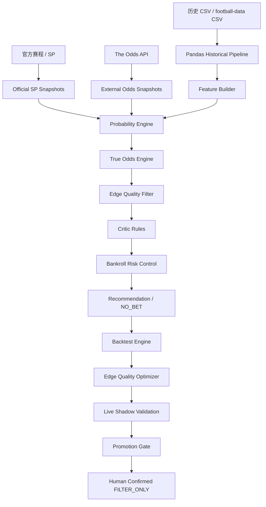

# 系统架构



## 后端模块

- `football_agents/cli.py`: 统一 CLI 入口。
- `football_agents/app.py`: FastAPI API 与静态页面服务。
- `football_agents/repository.py`: SQLite 数据读写封装。
- `football_agents/integrations/`: 外部赔率、新闻、天气等适配器。
- `football_agents/pandas_pipeline.py`: pandas 历史数据处理。
- `football_agents/features.py`: 球队历史特征构建。
- `football_agents/true_odds_engine.py`: True Odds 估计。
- `football_agents/edge_quality.py`: Edge Quality 评分。
- `football_agents/risk/`: bankroll 与风险策略。
- `football_agents/shadow_prediction_store.py`: Shadow 配置与预测持久化。
- `football_agents/promotion_gate.py`: Promotion Gate 决策。
- `football_agents/health.py`: 系统健康检查。

## 前端模块

- `frontend/src/pages/`: Dashboard、Match Detail、Backtest、Agent Monitor、System Health 等页面。
- `frontend/src/algorithm/`: 前端可解释算法模块与测试。
- `frontend/src/components/`: True Odds、Edge Quality、Optimizer 等面板。
- `football_agents/web/`: 构建后的前端静态产物。

## 数据库与 migrations

项目默认使用 SQLite：`data/runtime/football_agents.db`。基础 schema 位于 `football_agents/database/schema.sql`，增量迁移位于 `football_agents/migrations/`。运行：

```powershell
.\.venv\Scripts\python.exe -m football_agents.cli init-db
```

会创建表并应用 migrations。

## 调度任务

服务启动后可以运行官方数据、外部赔率、新闻、天气、特征、历史库、回测和治理等后台任务。任务执行状态通过 Agent / Workflow Monitor 和 System Health 页面查看。

## Health Check

`GET /health` 返回数据库、同步状态、模型治理、数据质量、任务运行和 Shadow Validation 状态，不暴露密钥。

## Shadow Validation 与 Promotion Gate

Shadow Validation 在真实赛前数据上运行候选 True Odds 配置，但只保存 shadow 记录。Promotion Gate 根据样本量、CLV、ROI、drawdown 和过滤质量给出建议，必须人工确认后才能激活 FILTER_ONLY。
